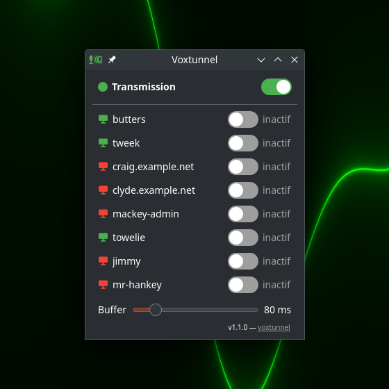

# Voxtunnel

**Your voice, tunneled straight to your servers.**

[English](#english) | [Francais](#francais) | [Website](https://remmmi.github.io/voxtunnel/) | [Latest release](https://github.com/remmmi/voxtunnel/releases/latest)

<p align="center"></p>

---

## English

You talk here. Your server hears it there. Voxtunnel streams your local
microphone over plain SSH to the virtual sound card of any of your
servers, where speech-to-text, voice assistants or Claude Code voice
input record it like a real microphone. No cloud relay, no account, no
audio codec voodoo — just your SSH keys and ALSA.

- **One switch per server.** The tray app reads `~/.ssh/config` and
  builds a switchboard out of your existing hosts and keys. Nothing to
  configure.
- **A master Transmission toggle.** Cut every stream in one click
  without losing your per-host selection; flip it back and the streams
  return.
- **Fast.** Raw PCM through SSH, about 150-200 ms end to end, with a
  latency/robustness slider right in the window.
- **Honest indicators.** A monitor glyph per host shows whether the
  remote end is ready to listen; a dead stream flips its switch off and
  tells you why.
- **Two-minute install.** Debian packages for both ends, or two small
  scripts. The server side is one kernel module, purely additive.

```
local machine                      server (VPS)
-----------------                  -------------------------------
mic -> arecord ---- ssh (raw PCM) ---> aplay -> snd-aloop loopback
                                                  ^
                                       any recorder reads it as a mic
                                       (plughw:Loopback,1,0)
```

### Requirements

Client (local Linux desktop):

| Package (Debian name)      | Purpose                         |
|----------------------------|---------------------------------|
| `openssh-client`           | transport                       |
| `alsa-utils`               | `arecord` capture (or `ffmpeg`) |
| `python3`, `python3-pyqt5` | tray app                        |
| `sox` (optional)           | `--tone` test signal            |

Server (VPS): `alsa-utils` and the `snd-aloop` kernel module. SSH key
authentication is required (`BatchMode=yes`, no password prompts).

### Install

Server — Debian package from the
[latest release](https://github.com/remmmi/voxtunnel/releases/latest)
(loads snd-aloop now and at every boot):

```
sudo apt install ./voxtunnel-server_*.deb
```

or with the script, as root:
`git clone https://github.com/remmmi/voxtunnel.git && sudo voxtunnel/server/setup-vps.sh --persist`

Client — Debian package, then run `voxtunnel`:

```
sudo apt install ./voxtunnel_*.deb
```

or from source, without root:

```
git clone https://github.com/remmmi/voxtunnel.git
cd voxtunnel/client
./voxtunnel.sh --check    # VPS_HOST=user@my-vps ./voxtunnel.sh --check
./install.sh              # menu launcher; --autostart for session start
python3 voxtunnel-tray.py
```

### The tray app

Every `Host` with an `IdentityFile` in `~/.ssh/config` gets a switch
(wildcards and `github.com` are skipped; add exclusions in
`~/.config/voxtunnel/ignore`, one host per line). Several streams can
run at once. Left click the tray icon to show the window, right click
for the same switches in a menu. Green icon: transmission enabled; red
crossed icon: transmission cut. Logs per host in
`~/.cache/voxtunnel/<host>.log`. No automatic reconnect by design: a
dead stream turns its switch off and shows the error.

### The engine without the GUI

`voxtunnel.sh` works on its own, configured by environment variables
(`VPS_HOST`, `MIC`, `RATE`, `BUFFER_US`, `PERIOD_US`):

```
VPS_HOST=user@my-vps ./voxtunnel.sh --check   # verify both ends
VPS_HOST=user@my-vps ./voxtunnel.sh           # stream until Ctrl-C
VPS_HOST=user@my-vps ./voxtunnel.sh --tone    # 1 kHz test tone
```

Dropouts (xruns)? Raise the buffers: `BUFFER_US=200000 PERIOD_US=50000`.

### Debian packages, versioning, safety

`./build-deb.sh` builds `voxtunnel_<version>_all.deb` (client) and
`voxtunnel-server_<version>_all.deb` (server); prebuilt packages are
attached to each release. Version lives in `voxtunnel-tray.py`
(`__version__`), one git tag per release. Each folder ships a
`CLAUDE.md` so Claude Code (or any agent) can install that side without
breaking the machine. Tested on Debian with KDE Plasma (client) and a
Debian VPS (server).

---

## Francais

Vous parlez ici. Votre serveur entend la-bas. Voxtunnel streame votre
micro local, via SSH uniquement, vers la carte son virtuelle de
n'importe lequel de vos serveurs : la transcription vocale, un
assistant ou la saisie vocale de Claude Code l'enregistrent comme un
vrai micro. Pas de relais cloud, pas de compte, pas de codec exotique —
juste vos cles SSH et ALSA.

- **Un interrupteur par serveur.** L'app tray lit `~/.ssh/config` et
  construit un tableau de bord avec vos hosts et cles existants. Rien a
  configurer.
- **Un interrupteur maitre « Transmission ».** Coupez tous les streams
  d'un clic sans perdre votre selection par host ; retablissez, ils
  reviennent.
- **Rapide.** PCM brut dans SSH, environ 150-200 ms de bout en bout,
  avec un slider latence/robustesse directement dans la fenetre.
- **Des voyants honnetes.** Un petit ordinateur par host indique si le
  bout distant est pret a ecouter ; un stream mort repasse son
  interrupteur a OFF en expliquant pourquoi.
- **Installe en deux minutes.** Paquets Debian pour les deux bouts, ou
  deux petits scripts. Cote serveur : un module noyau, purement additif.

### Installation

Serveur — paquet Debian de la
[derniere release](https://github.com/remmmi/voxtunnel/releases/latest)
(charge snd-aloop immediatement et a chaque demarrage) :

```
sudo apt install ./voxtunnel-server_*.deb
```

ou avec le script, en root :
`git clone https://github.com/remmmi/voxtunnel.git && sudo voxtunnel/server/setup-vps.sh --persist`

Client — paquet Debian, puis lancez `voxtunnel` :

```
sudo apt install ./voxtunnel_*.deb
```

ou depuis les sources, sans root :

```
git clone https://github.com/remmmi/voxtunnel.git
cd voxtunnel/client
./voxtunnel.sh --check    # VPS_HOST=user@mon-vps ./voxtunnel.sh --check
./install.sh              # lanceur de menu ; --autostart pour le demarrage
python3 voxtunnel-tray.py
```

### L'app tray

Chaque `Host` de `~/.ssh/config` avec un `IdentityFile` recoit un
interrupteur (jokers et `github.com` ignores ; exclusions dans
`~/.config/voxtunnel/ignore`, un host par ligne). Plusieurs streams
peuvent tourner en meme temps. Clic gauche sur l'icone tray : la
fenetre ; clic droit : les memes interrupteurs en menu. Icone verte :
transmission active ; rouge barree : coupee. Logs par host dans
`~/.cache/voxtunnel/<host>.log`. Pas de reconnexion automatique, par
choix : un stream mort repasse a OFF et affiche l'erreur.

### Le moteur sans interface

`voxtunnel.sh` fonctionne seul, par variables d'environnement
(`VPS_HOST`, `MIC`, `RATE`, `BUFFER_US`, `PERIOD_US`) :

```
VPS_HOST=user@mon-vps ./voxtunnel.sh --check   # verifie les deux bouts
VPS_HOST=user@mon-vps ./voxtunnel.sh           # streame jusqu'a Ctrl-C
VPS_HOST=user@mon-vps ./voxtunnel.sh --tone    # ton de test 1 kHz
```

Micro-coupures (xruns) ? Remontez les tampons :
`BUFFER_US=200000 PERIOD_US=50000`.

### Paquets, versions, securite

`./build-deb.sh` construit les deux paquets, joints a chaque release.
La version vit dans `voxtunnel-tray.py` (`__version__`), un tag git par
release. Chaque dossier contient un `CLAUDE.md` pour que Claude Code
(ou tout agent) installe ce cote-la sans rien casser. Teste sur Debian
avec KDE Plasma (client) et un VPS Debian (serveur).
